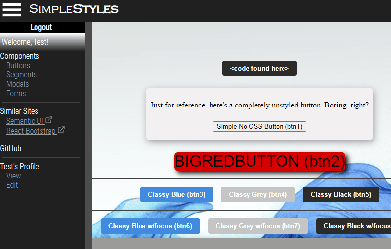

## Overview

The **SimpleStyles** app was created in order to exercise my ability to recreate components from Semantic UI, ReactBootstrap, and a few other sites just to see if I can do it. I've found that opting to not use these outside components has actually saved me a lot of time and hassle in the past, so I'm looking forward to having a repo set aside for myself that has unbroken code that wasn't written in 2018. No promises that I'm going to wow you, but I hope that what I'm able to produce is helpful to someone, someday.

**SimpleStyles** is built to provide prebuilt, user friendly React components to ease developer workflow when building React apps. It allows for the easy search and use of common React components, saving significant development time.

## Demo

[Live](https://simplestyles.herokuapp.com/)

## Login Credentials

Email: test@gmail.com  
Password: test123

## Tech Stack

React 
Ruby on Rails 
HTML5 
CSS

## Setup

#### Front End

cd recreating-react-components-from-scratch/ui 
To install the dependencies run 'npm install' 
Then run 'npm start' to run the front end at 'localhost:4000'

#### Back End

cd recreating-react-components-from-scratch/app 
To install dependencies run 'bundle i' in your terminal 
Then run 'rails s'
